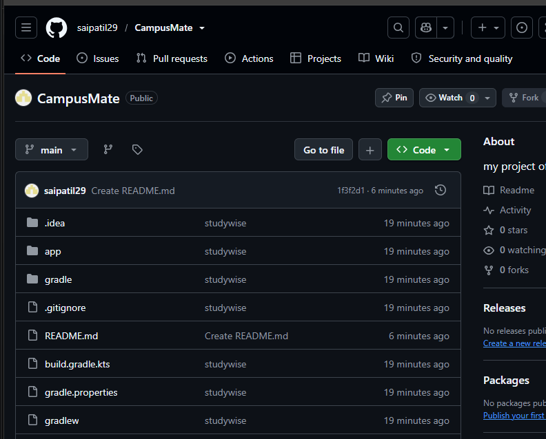
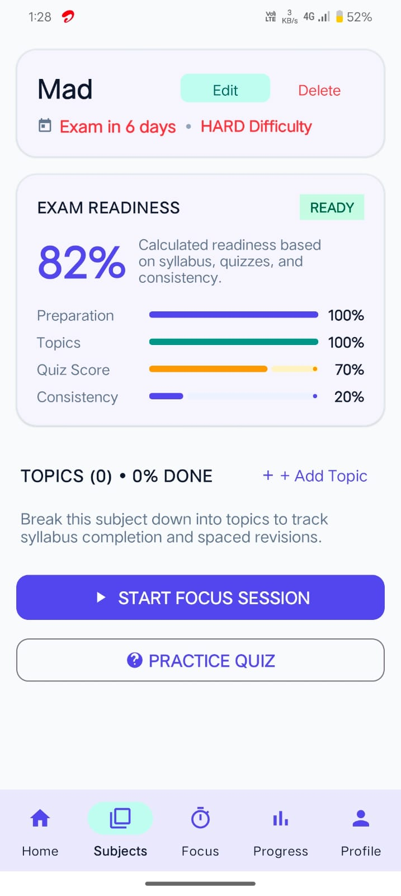
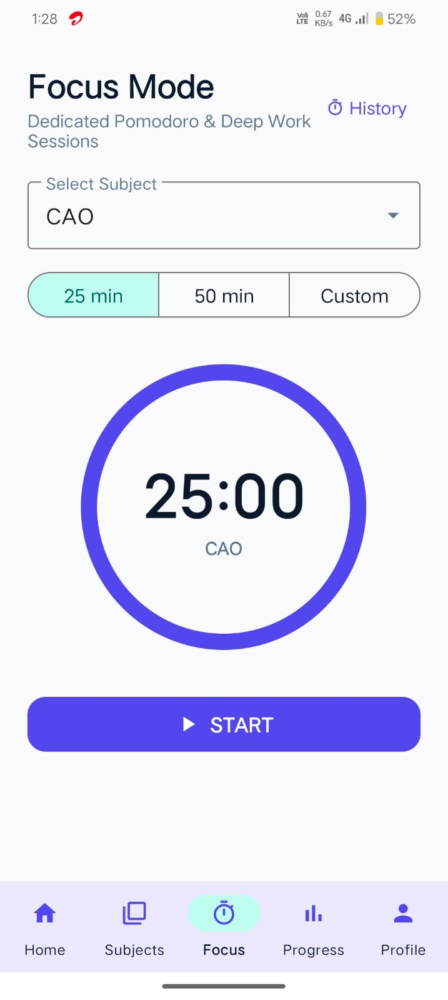
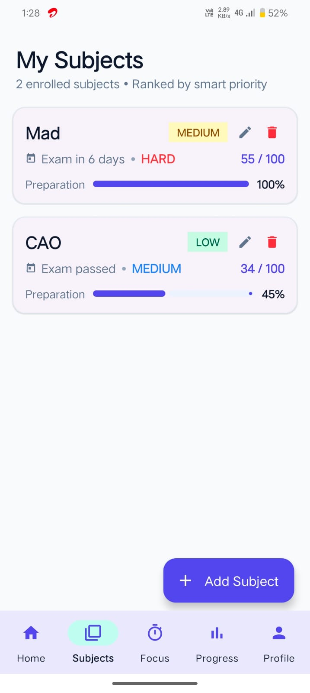

# 🎓 StudyWise

> **Plan Smarter • Study Better • Stay Consistent** 🚀

**StudyWise** is a student-focused Android application designed to make academic life easier by bringing **subjects, study planning, focus sessions, quizzes, revision, exam preparation, progress tracking, and achievements** into one place.

Instead of switching between different apps to organize studying, StudyWise connects academic activities around the student's **subjects** and helps answer one simple question:

> **What should I study today?**

---

## 📱 App Screenshots

### 🏠 Smart Dashboard

The dashboard gives students an instant overview of their daily study goal, current streak, smart study recommendation, and upcoming exams.

<p align="center">
  
</p>

---

### 📚 Subjects

Subjects are ranked using smart priority so students can quickly see which subject needs attention.

<p align="center">
  
</p>

---

### 📖 Subject Details & Exam Readiness

Each subject contains exam information, difficulty, preparation, topic progress, quiz score, consistency, and exam-readiness calculation.

<p align="center">
  
</p>

---

### ⏱️ Focus Mode

A dedicated Pomodoro and Deep Work screen helps students complete distraction-free study sessions with **25 min, 50 min, or custom durations**.

<p align="center">
  
</p>

---

### 📊 Progress & Analytics

Students can track total study time, today's activity, streaks, quiz performance, weekly activity, and subject preparation.

<p align="center">
  
</p>

---

### 👤 Profile & Preferences

Students can manage their profile, XP level, badges, theme, daily study target, and study reminders.

<p align="center">
  
</p>

---

# ✨ Key Features

| Feature | Description |
|---|---|
| 🏠 Smart Dashboard | Shows today's goal, streak, recommended focus, and upcoming exams |
| 📚 Subject Management | Create and manage academic subjects |
| 🧠 Smart Priority | Ranks subjects according to study needs |
| 📖 Topic Tracking | Break subjects into topics and monitor completion |
| ⏱️ Focus Mode | 25-minute, 50-minute, and custom study sessions |
| 🔄 Spaced Revision | Supports structured revision intervals |
| 🧠 Quiz System | Practice questions and track quiz scores |
| 📊 Analytics | Track study time, streaks, sessions, and preparation |
| 🎯 Exam Readiness | Calculates readiness from preparation, topics, quizzes, and consistency |
| 🏆 Gamification | XP, levels, streaks, and achievement badges |
| 🔔 Study Reminders | Notifications for exams and revisions |
| 🌙 Theme Support | System default, light mode, and dark mode |
| 💾 Local Storage | Uses Room Database for academic data |

---

# 🎯 How StudyWise Works

StudyWise connects the complete study workflow:

```text
                 🎓 STUDENT
                     │
                     ▼
              ┌──────────────┐
              │   STUDYWISE  │
              └──────┬───────┘
                     │
       ┌─────────────┼─────────────┐
       ▼             ▼             ▼
   📚 SUBJECTS   ⏱️ FOCUS       🧠 QUIZZES
       │             │             │
       ▼             ▼             ▼
   🧩 TOPICS     📊 HISTORY     📝 SCORES
       │             │             │
       └─────────────┼─────────────┘
                     ▼
              📈 PROGRESS
                     │
                     ▼
              🎯 BETTER PREP
```

### Example

```text
Computer Networks
│
├── 📅 Exam Date
├── 🧩 Topics
├── 🧠 Quizzes
├── ⏱️ Focus Sessions
├── 🔄 Revision
└── 📊 Preparation
```

Everything related to a subject stays connected.

---

# 🤖 Smart Study Recommendation

StudyWise can prioritize subjects using factors such as:

- 📅 Days remaining until exam
- 📚 Preparation percentage
- 🧩 Topic completion
- 🧠 Quiz performance
- 🔥 Study consistency
- ⚠️ Subject difficulty
- ⏱️ Previous study activity

Example:

```text
TODAY'S FOCUS

MAD
Exam in 6 days
Preparation: 100%

Priority Score: 55 / 100
Recommended Session: 45 minutes

WHY THIS SUBJECT?
Exam is approaching, the subject is
high difficulty, and recent study
activity needs attention.

[ START STUDY ]
```

---

# 🧠 Exam Readiness

StudyWise combines multiple academic indicators to estimate preparation.

```text
Exam Readiness
│
├── 📚 Preparation
├── 🧩 Topics
├── 🧠 Quiz Score
└── 🔥 Consistency
```

The result provides a quick indication such as:

```text
🟢 READY
🔵 ON TRACK
🟡 NEEDS WORK
🔴 AT RISK
```

---

# 🔄 Spaced Revision

StudyWise supports structured revision so students can revisit topics at useful intervals.

```text
Hard  → 1 day
Okay  → 3 days
Good  → 7 days
Easy  → 14 days
```

This helps students focus revision on topics that need more attention.

---

# ⏱️ Focus Mode

Focus Mode provides a distraction-free study timer.

Available durations:

```text
25 minutes
50 minutes
Custom
```

Basic workflow:

```text
Select Subject
      ↓
Select Duration
      ↓
Start Focus Session
      ↓
Complete Session
      ↓
Save Study Time
      ↓
Update Progress & Streak
```

---

# 📊 Progress & Analytics

StudyWise turns study activity into useful academic insights.

Students can track:

- ⏱️ Total study time
- 📅 Today's study time
- 🔥 Current streak
- 🏆 Best streak
- 🧠 Average quiz score
- 📚 Subject preparation
- 🎯 Completed sessions
- 📈 Weekly activity

---

# 🎮 Gamification

Studying becomes more engaging with:

### ⭐ XP & Levels
Earn XP through study activities and progress through levels.

### 🔥 Streaks
Build consistency by studying regularly.

### 🏆 Badges
Achievement examples:

- 🌱 First Step
- 🔥 Consistency Champion
- 📚 Dedicated Scholar
- 🧠 Knowledge Seeker
- 🎯 Goal Crusher

---

# 🛠️ Technology Stack

| Technology | Usage |
|---|---|
| **Kotlin** | Android application development |
| **Android Studio** | Development environment |
| **Android SDK 35** | Target platform |
| **Material Components** | UI components |
| **RecyclerView** | Dynamic lists |
| **Navigation Component** | Screen navigation |
| **ViewModel** | UI state and lifecycle management |
| **LiveData** | Observable data |
| **Room Database** | Local data storage |
| **Kotlin Coroutines** | Asynchronous operations |
| **View Binding** | Type-safe UI access |
| **JUnit** | Unit testing |

### Android Configuration

```text
Minimum SDK: 26
Target SDK: 35
Compile SDK: 35
```

---

# 🏗️ Architecture

```text
StudyWise
│
├── 🎨 UI
│   ├── Home
│   ├── Subjects
│   ├── Subject Details
│   ├── Focus
│   ├── Progress
│   ├── Quiz
│   └── Profile
│
├── 🧠 Domain
│   ├── Adaptive Scheduler
│   ├── Priority Calculator
│   ├── Exam Readiness
│   ├── Spaced Repetition
│   ├── Gamification
│   └── Streak Calculator
│
├── 💾 Data
│   ├── Room Database
│   ├── DAO
│   └── Entities
│
├── 🔄 Repository
│
└── 🛠️ Utilities
    ├── Date & Time
    ├── Notifications
    └── Demo Data
```

---

# 💾 Database

StudyWise uses **Room Database** for local academic data.

The application can store information such as:

- 👤 User preferences
- 📚 Subjects
- 🧩 Topics
- ⏱️ Study sessions
- 🧠 Quizzes
- 🏆 Badges

Core study data can remain available locally without requiring constant internet access.

---

# 🔔 Notifications

StudyWise can provide study-related reminders for:

- 📅 Upcoming exams
- 🔄 Revision
- 🎯 Study goals
- 📚 Academic activities

---

# 🧪 Testing

The project contains tests for important study-planning logic, including:

```text
AdaptiveSchedulerTest
ExamReadinessCalculatorTest
PriorityCalculatorTest
StreakCalculatorTest
```

---

# 🚀 Getting Started

## 1. Clone the Repository

```bash
git clone https://github.com/saipatil29/StudyWise.git
```

> If your GitHub repository uses a different URL, replace the URL above with your repository URL.

## 2. Open in Android Studio

```text
Android Studio → Open → StudyWise
```

## 3. Sync Gradle

Allow Android Studio to download and sync the required dependencies.

## 4. Run

Connect an Android device or start an emulator and press:

```text
▶ Run
```

---

# 📂 Project Structure

```text
StudyWise/
│
├── app/
│   └── src/
│       ├── main/
│       │   ├── java/
│       │   └── res/
│       │
│       └── test/
│
├── gradle/
├── build.gradle.kts
├── settings.gradle.kts
├── gradle.properties
├── gradlew
└── gradlew.bat
```

---

# 🎯 Project Goals

StudyWise aims to:

- ✅ Make academic planning easier
- ✅ Help students know what to study next
- ✅ Keep subjects and topics organized
- ✅ Encourage consistent study habits
- ✅ Track actual study time
- ✅ Improve exam preparation
- ✅ Make revision systematic
- ✅ Turn study activity into useful insights
- ✅ Make studying more engaging

---

# 🔮 Future Scope

Possible future improvements include:

- 📅 Full college timetable integration
- 🤖 AI-powered study assistant
- ☁️ Cloud synchronization
- 👥 Collaborative study and resource sharing
- 📱 Home-screen widgets
- 📊 Advanced academic analytics
- 🔔 Smarter personalized reminders
- 📚 Notes and document management
- 🧠 AI-generated quizzes
- 🎯 Personalized exam revision plans

---

# 👨‍💻 Author

**Harshal Patil**

B.Tech Computer Engineering Student

GitHub: [@saipatil29](https://github.com/saipatil29)

---

<div align="center">

## 🎓 StudyWise

### **Plan Smarter • Study Better • Stay Consistent**

**Built for students. Designed around the way students study.** ❤️

⭐ **Star the repository if you like the project!**

</div>
